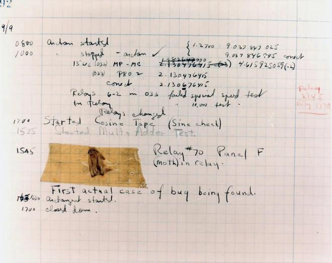

# Memory Manage Together

[toc]

### 👨‍💻链接：[cuber-lotus/Memory-Manage-Together](https://github.com/cuber-lotus/Memory-Manage-Together)

## 🐜介绍

**Memory Manage Together**

本项目主要记录各类在C/C++使用过程中，有关内存的各种事项。

如：

- 💥内存泄漏 **memory leak** 
- 💥内存溢出 **out of memory**
- 💥访问越界 **access violation**
- 💥等等

## 🐜展现形式

本仓库是一个 sample 的整合，不会涉及过多内部的底层设计等等。

一切回归到最接近每位coder的层面，一份文件一般对应一种问题。

### 👉 [目录](catalog/catalog.md)

## 🐜辅助工具

关于检测内存问题的工具有很多。这里推荐：

-  🔨 [valgrind](https://valgrind.org/)
- 🔨 [cppcheck](http://cppcheck.net/)

## 🐜交流合作

### 🐒主页：[cuber-lotus (天赐细莲) (github.com)](https://github.com/cuber-lotus)

本项目致力于打造为一个拥有丰富例子的仓库。

有各种有趣的场景或者idea可以直接提交issues。

---

---

---

# END